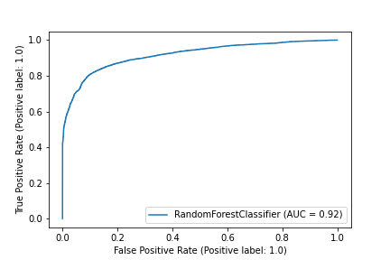
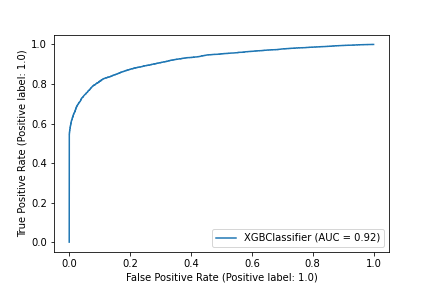

# Default Credit Card
The objective of the exercise is to find a model that explains the 
probability of customer default using the input variables. 
The target variable is: `default payment next month`.

### Setup: Conda (optional)

If you already hace Anaconda in your local machine, you can configure an environment
to reproduce the results of this repo with the following steps:
1. To create an environment: `conda create --name MYENV_NAME python=3.8`
2. When conda asks you to proceed, type `y`:
3. Activate the new environment: `conda activate MYENV_NAME`
4. Verify that the new environment was installed correctly: `conda env list`
5. Install requirements
6. Happy coding :)

### Requirements

* Python 3.8
* Install dependencies with: `pip install -r requirements.txt`
## About
This repository holds the code to make the analysis and model training.

*  `notebooks`: You can find all the notebooks and functions used to reproduce this
   work. To reproduce all the results, follow the order of the notebooks.
   
*  `models`: You can find all the models trained in this experiment, 
   additionally to two other files that holds artifacts related to each algorithm.
   
* `outputs`: You can find all the outputs generated during the analysis 
  such as images or excel spreadsheets.
  
* `data`: You can find the data used in this exercise. You cand download it
from this [website](https://archive.ics.uci.edu/ml/datasets/default+of+credit+card+clients).
  
### Results

I have been able to train two good candidates for the business problem stated.

* Option 1: Random Forest
    * Version name: `RandomForestClassifier-v4.pkl`
    * AUC: 0.92
    * F1 Score: 0.85
    * Accuracy: 0.85
    * Features used: 27
    * Path to features: `models/features_by_models/RandomForestClassifier_0.81.txt`
    

* Option 2: XGBOOST
    * Version name: `XGBClassifier-v4.pkl`
    * AUC: 0.92
    * F1 Score: 0.86
    * Accuracy: 0.86
    * Features used: 27
    * Path to features: `models/features_by_models/XGBClassifier_0.82.txt`

